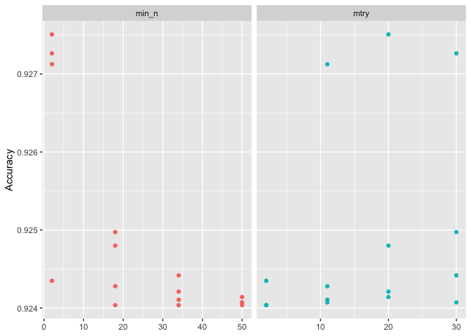
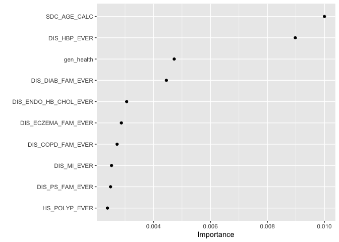

``` r
knitr::opts_chunk$set(echo = TRUE)
library(tidyverse)
```

```
## ── Attaching core tidyverse packages ──────────────────────── tidyverse 2.0.0 ──
## ✔ dplyr     1.1.4     ✔ readr     2.1.5
## ✔ forcats   1.0.0     ✔ stringr   1.5.2
## ✔ ggplot2   4.0.0     ✔ tibble    3.3.0
## ✔ lubridate 1.9.4     ✔ tidyr     1.3.1
## ✔ purrr     1.1.0     
## ── Conflicts ────────────────────────────────────────── tidyverse_conflicts() ──
## ✖ dplyr::filter() masks stats::filter()
## ✖ dplyr::lag()    masks stats::lag()
## ℹ Use the conflicted package (<http://conflicted.r-lib.org/>) to force all conflicts to become errors
```

``` r
library(tidymodels)
```

```
## ── Attaching packages ────────────────────────────────────── tidymodels 1.4.1 ──
## ✔ broom        1.0.10     ✔ rsample      1.3.1 
## ✔ dials        1.4.2      ✔ tailor       0.1.0 
## ✔ infer        1.0.9      ✔ tune         2.0.0 
## ✔ modeldata    1.5.1      ✔ workflows    1.3.0 
## ✔ parsnip      1.3.3      ✔ workflowsets 1.1.1 
## ✔ recipes      1.3.1      ✔ yardstick    1.3.2 
## ── Conflicts ───────────────────────────────────────── tidymodels_conflicts() ──
## ✖ scales::discard() masks purrr::discard()
## ✖ dplyr::filter()   masks stats::filter()
## ✖ recipes::fixed()  masks stringr::fixed()
## ✖ dplyr::lag()      masks stats::lag()
## ✖ yardstick::spec() masks readr::spec()
## ✖ recipes::step()   masks stats::step()
```

``` r
library(sjPlot)
```

```
## 
## Attaching package: 'sjPlot'
## 
## The following object is masked from 'package:ggplot2':
## 
##     set_theme
```

``` r
library(C50)
library(finalfit)
library(knitr)
library(gtsummary)
library(mlbench)
library(vip)
```

```
## 
## Attaching package: 'vip'
## 
## The following object is masked from 'package:utils':
## 
##     vi
```

``` r
library(rsample)
library(rpart.plot)
```

```
## Loading required package: rpart
## 
## Attaching package: 'rpart'
## 
## The following object is masked from 'package:dials':
## 
##     prune
```

``` r
library(tune)
library(recipes)
library(yardstick)
library(parsnip)
library(glmnet)
```

```
## Loading required package: Matrix
## 
## Attaching package: 'Matrix'
## 
## The following objects are masked from 'package:tidyr':
## 
##     expand, pack, unpack
## 
## Loaded glmnet 4.1-10
```

``` r
library(ranger)
library(themis)
library(microbenchmark)
```

# Random Forest

## Research question and data

We are using an imputed (ie. no missing data) version of the CanPath student dataset [https://canpath.ca/student-dataset/](https://canpath.ca/student-dataset/). The nice thing about this dataset is that it's pretty big in terms of sample size, has lots of variables, and we can use it for free. 
Our research question is:  

- **Can we develop a model that will predict general health status**

### Reading in data

Here are reading in data and getting organized to run our models. 


``` r
data <- read_csv("canpath_data.csv")
```

```
## Rows: 41187 Columns: 93
## ── Column specification ────────────────────────────────────────────────────────
## Delimiter: ","
## chr  (1): ID
## dbl (92): ADM_STUDY_ID, SDC_GENDER, SDC_AGE_CALC, SDC_MARITAL_STATUS, SDC_ED...
## 
## ℹ Use `spec()` to retrieve the full column specification for this data.
## ℹ Specify the column types or set `show_col_types = FALSE` to quiet this message.
```

``` r
data <- data %>% mutate_at(3, factor)
data <- data %>% mutate_at(5:6, factor)
data <- data %>% mutate_at(8:12, factor)
data <- data %>% mutate_at(15:81, factor)
data <- data %>% mutate_at(83:93, factor)

data$ID <- NULL
data$ADM_STUDY_ID <- NULL
```

#### Diabetes

Preparing diabetes data


``` r
table(data$DIS_DIAB_EVER)
```

```
## 
##     0     1     2 
## 36714  3114  1359
```

``` r
data <- data %>%
	mutate(diabetes = case_when(
		DIS_DIAB_EVER == 0 ~ "No",
		DIS_DIAB_EVER == 1 ~ "Yes",
		DIS_DIAB_EVER == 2 ~ "No")) %>%
		mutate(diabetes = as.factor(diabetes))

table(data$DIS_DIAB_EVER, data$diabetes)
```

```
##    
##        No   Yes
##   0 36714     0
##   1     0  3114
##   2  1359     0
```

``` r
data$DIS_DIAB_EVER <- NULL
```

#### General Health


``` r
table(data$HS_GEN_HEALTH)
```

```
## 
##     1     2     3     4     5 
##   832  3377 12783 17183  7012
```

``` r
### Combining levels 1 and 2 just to have enough sample. We won't do upscaling for this example
data <- data %>%
	mutate(gen_health = case_when(
		HS_GEN_HEALTH == 1 ~ 1,
		HS_GEN_HEALTH == 2 ~ 1,
		HS_GEN_HEALTH == 3 ~ 2,
		HS_GEN_HEALTH == 4 ~ 3,	
		HS_GEN_HEALTH == 5 ~ 4)) %>%
		mutate(gen_health = as.factor(gen_health))

table(data$HS_GEN_HEALTH, data$gen_health)
```

```
##    
##         1     2     3     4
##   1   832     0     0     0
##   2  3377     0     0     0
##   3     0 12783     0     0
##   4     0     0 17183     0
##   5     0     0     0  7012
```

``` r
data$HS_GEN_HEALTH <- NULL
```

#### Simplifying the data

Here I'm simplifying the data because the models take a long time to run and for teaching purposes we need models that run in a reasonable amount of time. 


``` r
data_small <- select(data, diabetes, gen_health, SDC_AGE_CALC, SDC_EDU_LEVEL, PM_BMI_SR, WRK_FULL_TIME, SMK_CIG_EVER, SDC_INCOME, PA_TOTAL_SHORT, HS_ROUTINE_VISIT_EVER, PSE_ADULT_WRK_DURATION, DIS_RESP_SLEEP_APNEA_EVER, SDC_EDU_LEVEL_AGE, SDC_GENDER)
```

### Decision tree

Good walk through of decision tree and how to visualize the tree [here](https://emilhvitfeldt.github.io/ISLR-tidymodels-labs/08-tree-based-methods.html)

Same as usual with tidymodels we are going to prepare the model and the recipe in order to run the analysis. Here we are skipping the recipe part just to show the CART approach before moving into Random Forest.

### Random Forest

Random forests or random decision forests is an ensemble learning method for classification, regression and other tasks that works by creating a multitude of decision trees during training. For classification tasks, the output of the random forest is the class selected by most trees. It is one of most commonly used methods for physical activity classification... though a bit old now. [https://en.wikipedia.org/wiki/Random_forest](https://en.wikipedia.org/wiki/Random_forest)

We will use the Tidymodels framework for model fitting. Good tutorials for Tidymodels are below

* [https://emilhvitfeldt.github.io/ISLR-tidymodels-labs/](https://emilhvitfeldt.github.io/ISLR-tidymodels-labs/)
* [https://lsinks.github.io/posts/2023-04-10-tidymodels/tidymodels_tutorial.html](https://lsinks.github.io/posts/2023-04-10-tidymodels/tidymodels_tutorial.html)

We will use of a 5 fold cross validation and leave 2 test sets. Cross validation works as per the image below. In this example we will not finalize the analysis and run on the test set, just for the sake of time. 

 


``` r
# Fix the random numbers by setting the seed 
# This enables the analysis to be reproducible when random numbers are used 
set.seed(10)

#### Cross Validation Split
cv_split <- initial_validation_split(data, 
                            strata = diabetes, 
                            prop = c(0.70, 0.20))

# Create data frames for the two sets:
train_data <- training(cv_split)
table(train_data$diabetes)
```

```
## 
##    No   Yes 
## 26640  2190
```

``` r
test_data  <- testing(cv_split)
table(test_data$diabetes)
```

```
## 
##   No  Yes 
## 3813  306
```

### Model 

Here we use the tidy models to setup a model using `ranger` and `classification` and we call the specific model we want to fit. `ranger` is the default package but there are additional engines you could use in [tidymodels](https://parsnip.tidymodels.org/reference/rand_forest.html)

* ranger
* aorsf
* h2o
* partykit
* randomForest
* spark

I'm fixing mtry = 5, min_n = 10, and tress = 10 just to make the model run more efficiently in class. These are hyperparameters for your model. 

* __mtry__: An integer for the number of predictors that will be randomly sampled at each split when creating the tree models.
* __trees__: An integer for the number of trees contained in the ensemble.
* __min_n__: An integer for the minimum number of data points in a node that are required for the node to be split further.

Normally you want to tune these to find the optimal values. This optimization process can take a long time and is best done using parallel processing. More information about model tuning using tidymodels in [this tutorial](https://juliasilge.com/blog/sf-trees-random-tuning/).


``` r
### Set the number of cores on your computer
cores <- parallel::detectCores()
cores
```

```
## [1] 10
```

Save the random forest model object. We set `num.threads = cores` because `ranger` will do parrallel processing so the modes will run more quickly. 


``` r
rf_model <- rand_forest(mtry = tune(), min_n = tune(), trees = 100) %>% 
              set_engine("ranger", num.threads = cores) %>% 
              set_mode("classification")
```

#### Recipe

The recipe() function as we used it here has two arguments

1. A formula. Any variable on the left-hand side of the tilde (~) is considered the model outcome (here, activity). On the right-hand side of the tilde are the predictors. Variables may be listed by name, or you can use the dot (.) to indicate all other variables as predictors.
2. The data. A recipe is associated with the data set used to create the model. This will typically be the training set, so `data = train_data` here. Naming a data set doesn’t actually change the data itself; it is only used to catalog the names of the variables and their types, like factors, integers, dates, etc.

Now we can add roles to this recipe. We can use the `update_role()` function to let recipes know that `id` is a variable with a custom role that we called "ID" (a role can have any character value). Whereas our formula included all variables in the training set other than activity as predictors (that's what the `.` does), this tells the recipe to keep these two variables but not use them as either outcomes or predictors.


``` r
health_recipe <- 
  recipe(diabetes ~ ., data = train_data) %>% 
  step_zv(all_predictors()) ### Remove columns from the data when the training set data have a single value. Zero variance predictor
```

#### Create a workflow

A workflow connects our recipe with out model. The workflow let's us setup the models without actually have run things over and over again. This is helpful because as you will sometimes models can take a long time to run. 


``` r
health_workflow <- 
        workflow() %>% 
        add_model(rf_model) %>% 
        add_recipe(health_recipe)

health_workflow
```

```
## ══ Workflow ════════════════════════════════════════════════════════════════════
## Preprocessor: Recipe
## Model: rand_forest()
## 
## ── Preprocessor ────────────────────────────────────────────────────────────────
## 1 Recipe Step
## 
## • step_zv()
## 
## ── Model ───────────────────────────────────────────────────────────────────────
## Random Forest Model Specification (classification)
## 
## Main Arguments:
##   mtry = tune()
##   trees = 100
##   min_n = tune()
## 
## Engine-Specific Arguments:
##   num.threads = cores
## 
## Computational engine: ranger
```

### Fit a model 


``` r
set.seed(100)

folds <- vfold_cv(train_data, v = 10) 

rf_grid <- grid_regular(
              mtry(range = c(2, 30)),
              min_n(range = c(2, 50)),
              levels = 4  
            )

rf_grid
```

```
## # A tibble: 16 × 2
##     mtry min_n
##    <int> <int>
##  1     2     2
##  2    11     2
##  3    20     2
##  4    30     2
##  5     2    18
##  6    11    18
##  7    20    18
##  8    30    18
##  9     2    34
## 10    11    34
## 11    20    34
## 12    30    34
## 13     2    50
## 14    11    50
## 15    20    50
## 16    30    50
```

``` r
health_fit <- tune_grid(
                health_workflow,
                resamples = folds,
                grid = rf_grid, 
                control = control_resamples(save_pred = TRUE, 
                                                  verbose = FALSE))

health_fit
```

```
## # Tuning results
## # 10-fold cross-validation 
## # A tibble: 10 × 5
##    splits               id     .metrics          .notes           .predictions
##    <list>               <chr>  <list>            <list>           <list>      
##  1 <split [25947/2883]> Fold01 <tibble [48 × 6]> <tibble [0 × 4]> <tibble>    
##  2 <split [25947/2883]> Fold02 <tibble [48 × 6]> <tibble [0 × 4]> <tibble>    
##  3 <split [25947/2883]> Fold03 <tibble [48 × 6]> <tibble [0 × 4]> <tibble>    
##  4 <split [25947/2883]> Fold04 <tibble [48 × 6]> <tibble [0 × 4]> <tibble>    
##  5 <split [25947/2883]> Fold05 <tibble [48 × 6]> <tibble [0 × 4]> <tibble>    
##  6 <split [25947/2883]> Fold06 <tibble [48 × 6]> <tibble [0 × 4]> <tibble>    
##  7 <split [25947/2883]> Fold07 <tibble [48 × 6]> <tibble [0 × 4]> <tibble>    
##  8 <split [25947/2883]> Fold08 <tibble [48 × 6]> <tibble [0 × 4]> <tibble>    
##  9 <split [25947/2883]> Fold09 <tibble [48 × 6]> <tibble [0 × 4]> <tibble>    
## 10 <split [25947/2883]> Fold10 <tibble [48 × 6]> <tibble [0 × 4]> <tibble>
```

#### Plot of the results. 

Default here is to run 3 iterations for each of the values. We ran it with 5 instead which is why you see there are 5 points for each min_n and mtry.


``` r
health_fit %>%
  collect_metrics() %>%
  filter(.metric == "accuracy") %>%
  select(mean, min_n, mtry) %>%
  pivot_longer(min_n:mtry,
    values_to = "value",
    names_to = "parameter"
  ) %>%
  ggplot(aes(value, mean, color = parameter)) +
  geom_point(show.legend = FALSE) +
  facet_wrap(~parameter, scales = "free_x") +
  labs(x = NULL, y = "Accuracy")
```

<!-- -->

### Different way to plot


``` r
health_fit %>%
  collect_metrics() %>%
  filter(.metric == "accuracy") %>%
  mutate(min_n = factor(min_n)) %>%
  ggplot(aes(mtry, mean, color = min_n)) +
  geom_line(alpha = 0.5, size = 1.5) +
  geom_point() +
  labs(y = "Accuracy")
```

```
## Warning: Using `size` aesthetic for lines was deprecated in ggplot2 3.4.0.
## ℹ Please use `linewidth` instead.
## This warning is displayed once every 8 hours.
## Call `lifecycle::last_lifecycle_warnings()` to see where this warning was
## generated.
```

<!-- -->

### Collect the results


``` r
rf_best <- 
  health_fit %>% 
  select_best(metric = "accuracy")

rf_best
```

```
## # A tibble: 1 × 3
##    mtry min_n .config         
##   <int> <int> <chr>           
## 1    20     2 pre0_mod09_post0
```

``` r
rf_auc_fit <- 
  health_fit %>% 
  collect_predictions(parameters = rf_best) 
```

### Metrics

#### Confusion Matrix

We can generate a confusion matrix by using the `conf_mat()` function by supplying the data frame (`rf_auc_fit`), the truth column `gen_health` and predicted class `.pred_class` in the estimate attribute.

A confusion matrix is sort of a 2x2 (or n*n table for multiclass problems) table with the true values on one side and predicted values in another column. If we look on the diagonal we see when the model correctly predicts the values `gen_health` and off diagonal is when the model does not predict the correct value.

Here is the confusion matrix for all 5 of the folds. 


``` r
conf_mat(rf_auc_fit, truth = diabetes,
         estimate = .pred_class)
```

```
##           Truth
## Prediction    No   Yes
##        No  26618  2068
##        Yes    22   122
```

#### Accuracy

We can calculate the classification accuracy by using the `accuracy()` function by supplying the final data frame `rf_auc_fit`, the truth column `gen_health` and predicted class `.pred_class` in the estimate attribute. 


``` r
accuracy(rf_auc_fit, truth = diabetes,
         estimate = .pred_class)
```

```
## # A tibble: 1 × 3
##   .metric  .estimator .estimate
##   <chr>    <chr>          <dbl>
## 1 accuracy binary         0.928
```

#### Sensitivity


``` r
sens(rf_auc_fit, truth = diabetes,
         estimate = .pred_class)
```

```
## # A tibble: 1 × 3
##   .metric .estimator .estimate
##   <chr>   <chr>          <dbl>
## 1 sens    binary         0.999
```

#### Specificity


``` r
spec(rf_auc_fit, truth = diabetes,
         estimate = .pred_class)
```

```
## # A tibble: 1 × 3
##   .metric .estimator .estimate
##   <chr>   <chr>          <dbl>
## 1 spec    binary        0.0557
```

#### F1 Score


``` r
f_meas(rf_auc_fit, truth = diabetes,
         estimate = .pred_class)
```

```
## # A tibble: 1 × 3
##   .metric .estimator .estimate
##   <chr>   <chr>          <dbl>
## 1 f_meas  binary         0.962
```

## Final model

Above we are looking at our trained model over the cross-validation sets. We have not actually tested our model on our test data. To run the last model we need to back to our workflow and use the `last_fit` function. Note that we use the `cv_split` object rather than the train or test data objects. This will will fit the model to the entire training set and evaluate it with the testing set. We need to back to our workflow object (somewhat counter intuitive). 


``` r
final_model <- finalize_model(
                  rf_model,
                  rf_best
                )

final_model
```

```
## Random Forest Model Specification (classification)
## 
## Main Arguments:
##   mtry = 20
##   trees = 100
##   min_n = 2
## 
## Engine-Specific Arguments:
##   num.threads = cores
## 
## Computational engine: ranger
```

### Variable Importance


``` r
tree_prep <- prep(health_recipe)

final_model %>%
  set_engine("ranger", importance = "permutation") %>%
  fit(diabetes ~ .,
    data = juice(tree_prep)) %>%
  vip(geom = "point")
```

<!-- -->

### Final Model Fit


``` r
final_rf_workflow <- workflow() %>%
                      add_recipe(health_recipe) %>%
                      add_model(final_model)

final_results <- final_rf_workflow %>%
                    last_fit(cv_split)

final_results %>%
  collect_metrics()
```

```
## # A tibble: 3 × 4
##   .metric     .estimator .estimate .config        
##   <chr>       <chr>          <dbl> <chr>          
## 1 accuracy    binary        0.930  pre0_mod0_post0
## 2 roc_auc     binary        0.792  pre0_mod0_post0
## 3 brier_class binary        0.0595 pre0_mod0_post0
```

## Session Info


``` r
sessionInfo()
```

```
## R version 4.5.1 (2025-06-13)
## Platform: aarch64-apple-darwin20
## Running under: macOS Sequoia 15.7.1
## 
## Matrix products: default
## BLAS:   /Library/Frameworks/R.framework/Versions/4.5-arm64/Resources/lib/libRblas.0.dylib 
## LAPACK: /Library/Frameworks/R.framework/Versions/4.5-arm64/Resources/lib/libRlapack.dylib;  LAPACK version 3.12.1
## 
## locale:
## [1] en_US.UTF-8/en_US.UTF-8/en_US.UTF-8/C/en_US.UTF-8/en_US.UTF-8
## 
## time zone: America/Regina
## tzcode source: internal
## 
## attached base packages:
## [1] stats     graphics  grDevices utils     datasets  methods   base     
## 
## other attached packages:
##  [1] microbenchmark_1.5.0 themis_1.0.3         ranger_0.17.0       
##  [4] glmnet_4.1-10        Matrix_1.7-3         rpart.plot_3.1.3    
##  [7] rpart_4.1.24         vip_0.4.1            mlbench_2.1-6       
## [10] gtsummary_2.4.0      knitr_1.50           finalfit_1.1.0      
## [13] C50_0.2.0            sjPlot_2.9.0         yardstick_1.3.2     
## [16] workflowsets_1.1.1   workflows_1.3.0      tune_2.0.0          
## [19] tailor_0.1.0         rsample_1.3.1        recipes_1.3.1       
## [22] parsnip_1.3.3        modeldata_1.5.1      infer_1.0.9         
## [25] dials_1.4.2          scales_1.4.0         broom_1.0.10        
## [28] tidymodels_1.4.1     lubridate_1.9.4      forcats_1.0.0       
## [31] stringr_1.5.2        dplyr_1.1.4          purrr_1.1.0         
## [34] readr_2.1.5          tidyr_1.3.1          tibble_3.3.0        
## [37] ggplot2_4.0.0        tidyverse_2.0.0     
## 
## loaded via a namespace (and not attached):
##  [1] libcoin_1.0-10      RColorBrewer_1.1-3  rstudioapi_0.17.1  
##  [4] jsonlite_2.0.0      shape_1.4.6.1       magrittr_2.0.4     
##  [7] jomo_2.7-6          farver_2.1.2        nloptr_2.2.1       
## [10] rmarkdown_2.29      vctrs_0.6.5         minqa_1.2.8        
## [13] sparsevctrs_0.3.4   htmltools_0.5.8.1   Formula_1.2-5      
## [16] mitml_0.4-5         sass_0.4.10         parallelly_1.45.1  
## [19] bslib_0.9.0         plyr_1.8.9          cachem_1.1.0       
## [22] lifecycle_1.0.4     iterators_1.0.14    pkgconfig_2.0.3    
## [25] R6_2.6.1            fastmap_1.2.0       rbibutils_2.3      
## [28] future_1.67.0       digest_0.6.37       furrr_0.3.1        
## [31] labeling_0.4.3      timechange_0.3.0    compiler_4.5.1     
## [34] bit64_4.6.0-1       withr_3.0.2         S7_0.2.0           
## [37] backports_1.5.0     pan_1.9             MASS_7.3-65        
## [40] lava_1.8.1          tools_4.5.1         future.apply_1.20.0
## [43] nnet_7.3-20         glue_1.8.0          nlme_3.1-168       
## [46] inum_1.0-5          grid_4.5.1          Cubist_0.5.0       
## [49] reshape2_1.4.4      generics_0.1.4      gtable_0.3.6       
## [52] tzdb_0.5.0          class_7.3-23        data.table_1.17.8  
## [55] hms_1.1.3           utf8_1.2.6          foreach_1.5.2      
## [58] pillar_1.11.1       vroom_1.6.5         partykit_1.2-24    
## [61] splines_4.5.1       lhs_1.2.0           lattice_0.22-7     
## [64] survival_3.8-3      bit_4.6.0           tidyselect_1.2.1   
## [67] reformulas_0.4.1    xfun_0.53           hardhat_1.4.2      
## [70] timeDate_4041.110   stringi_1.8.7       DiceDesign_1.10    
## [73] yaml_2.3.10         boot_1.3-31         evaluate_1.0.5     
## [76] codetools_0.2-20    cli_3.6.5           Rdpack_2.6.4       
## [79] jquerylib_0.1.4     Rcpp_1.1.0          ROSE_0.0-4         
## [82] globals_0.18.0      parallel_4.5.1      gower_1.0.2        
## [85] GPfit_1.0-9         lme4_1.1-37         listenv_0.9.1      
## [88] mvtnorm_1.3-3       ipred_0.9-15        prodlim_2025.04.28 
## [91] crayon_1.5.3        rlang_1.1.6         mice_3.18.0
```

